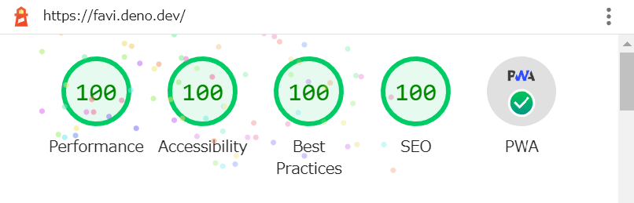

# favi.deno.dev

Source code for [favi.deno.dev](https://favi.deno.dev).

### develop

```shell
> deno task start
```

### How it works

- When accessed for the first time, a response is returned from CDN Edge (deno
  deploy). ─ about 300ms
- For the second and subsequent accesses, a response will be returned from the
  service worker. ─ about 100ms


